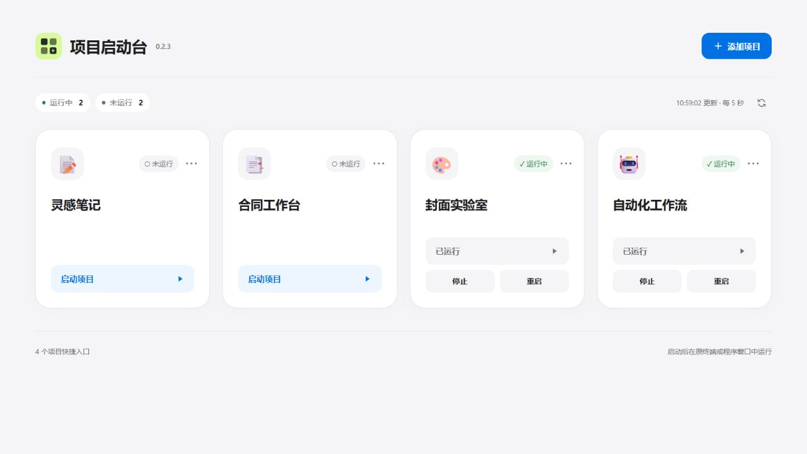

# Codex Project Launcher

**Codex 项目启动台**：把原有的启动脚本、快捷方式和 PowerShell 命令集中到一个面板，点击即可启动、查看状态、正常停止和重启。

**v0.2.3 · Windows 10/11 · Node.js 22+ · PowerShell 7+ · MIT**



## 安装到 Codex

1. 安装 [Node.js 22+](https://nodejs.org/en/download)、[PowerShell 7+](https://github.com/PowerShell/PowerShell/releases) 和 [Codex 桌面端](https://developers.openai.com/codex/app)。还需要 [Codex CLI](https://developers.openai.com/codex/cli)，在 PowerShell 中执行 `codex --version` 应能显示版本。
2. 从 [Releases 下载 Windows 使用包](https://github.com/linsank2005/codex-project-launcher/releases/latest)，解压到固定目录。使用包名为 `codex-project-launcher-0.2.3-windows.zip`；运行无需 `npm install`。
3. 双击 **安装插件.cmd**，等待安装成功。在 Codex 新建聊天，输入：

   > 使用 Codex Project Launcher 打开项目启动台。

如果宿主未显示嵌入界面，打开工具返回的本地链接即可。插件安装器会备份已有 Codex 配置；内部标识保留为 `start-buttons@start-buttons-local`。

**不使用 Codex 也可以运行：** 完成 Node.js 和 PowerShell 安装后，双击 **启动面板.cmd**，打开本机 `http://127.0.0.1:47831/`。

## 添加和使用项目

点击 **添加项目**，选图标、填名称，然后保存原有入口：

| 启动方式 | 填写内容 |
| --- | --- |
| 已有启动文件 / 快捷方式 | 文件完整路径，例如 `D:\Projects\demo\start.cmd`。支持 `.ps1`、`.cmd`、`.bat`、`.lnk`、`.exe`、`.url`。 |
| PowerShell 命令 | 项目目录和原命令，例如目录 `D:\Projects\demo`，命令 `npm run dev`。 |

- 点击 **启动项目**；程序在自己的终端或窗口中运行。
- 状态每 5 秒自动更新；点击状态标记可查看检查原因。
- 运行中的项目可以 **停止** 或 **重启**。如原项目需要专用停止命令，可在编辑中的“停止方式”填写。
- 点击卡片 **⋯** 编辑或移除入口，移除不会删除项目文件。

入口路径不变时，更新项目代码后无需重新添加。关闭面板不会关闭已经启动的项目；停止使用正常退出方式，原项目不响应时需要在原窗口处理。

配置只保存在本机 `%LOCALAPPDATA%\StartButtons\`；面板仅监听本机，无遥测。保存的启动、停止命令以当前用户权限执行。

## 常见问题

- **显示“待确认”：** 点击状态查看原因；可以在编辑中填写此项目的本机 HTTP 页面或健康地址。
- **提示找不到 `codex`、`node` 或 PowerShell 7：** 确认相应程序已安装；重新打开终端后检查 `codex --version`、`node --version`、`pwsh --version`。
- **重复安装提示缓存被占用：** 关闭插件面板并重启 Codex，再运行安装器。

更多说明见 [使用与排错](docs/USAGE.md)。本项目通过 [官方本地 marketplace 机制](https://developers.openai.com/plugins/build/plugins#add-a-marketplace-from-the-cli)安装，GitHub 发布不等于进入官方插件目录。

## 开发

```powershell
npm ci --ignore-scripts
npm run check
npm run release:prepare
```

测试包含真实 Windows 隔离服务的启动、Ctrl+C、停止、重启、状态归属与访问边界；CI 使用 Windows。已安装插件可执行 `node scripts/check-codex.mjs` 验证加载。

[更新记录](CHANGELOG.md) · [发布说明](docs/PUBLIC_RELEASE.md) · [MIT 许可证](LICENSE) · [第三方许可](THIRD_PARTY_NOTICES.txt)
